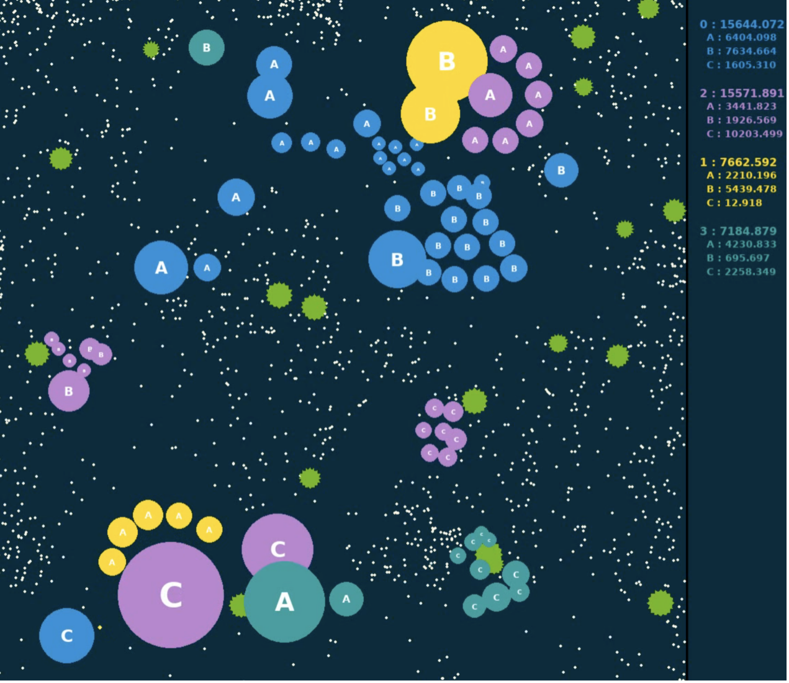
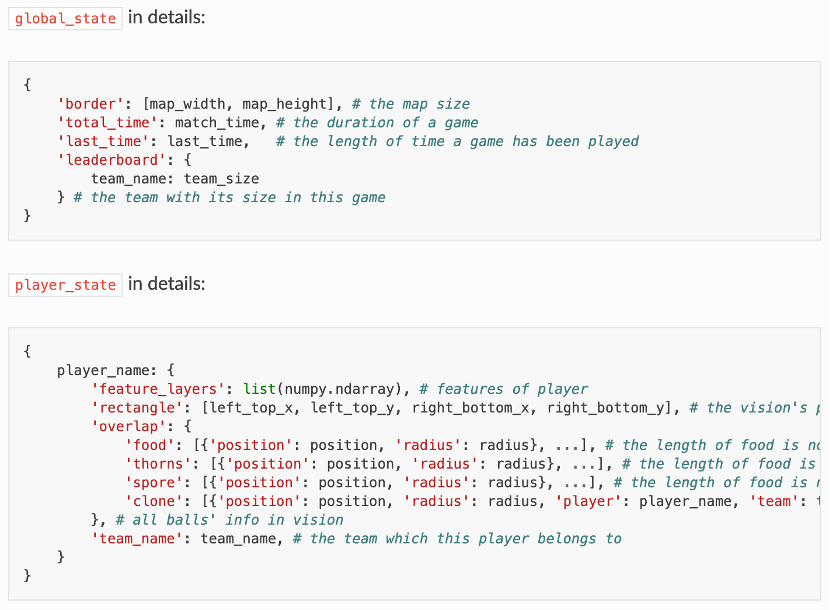
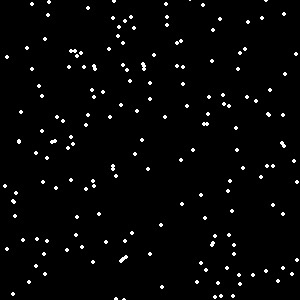
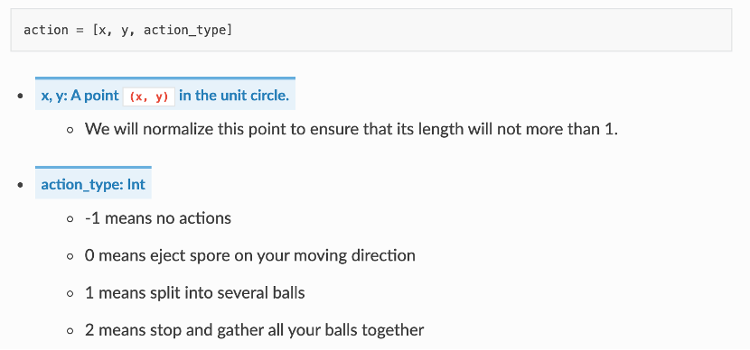
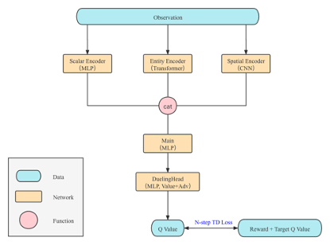

# How to train di_baseine

[en](https://github.com/opendilab/GoBigger-Challenge-2021/blob/main/di_baseline/README.md) / [中文](https://github.com/opendilab/GoBigger-Challenge-2021/blob/main/di_baseline/README_zh.md)

## 1. Baseline Introduction 

The purpose of the algorithm baseline is to verify the initial effect of the reinforcement learning algorithm in the environment, and to do a simple combing and analysis of each link. After the contestants get started quickly, they can design their own intelligent body with the strongest performance.

The reinforcement learning baseline of the Go-Bigger environment is mainly divided into three parts:
- Environment modeling：Simplify the game environment into a standard environment format suitable for reinforcement learning.
- Basic algorithm selection：Choose a RL algorithm according to the basic information of the environment.
- Custom training process：Customize the training process according to the special characteristics of the environment.

## 2. Environment modeling

### 1. How to design an observation space

Go-Bigger looks like this from a human perspective:

<div align=center></div>

The structured information in the game engine looks like this:

<div align=center></div>

And these simple data representations are very unfriendly to computers and neural networks, so we need to process this information to a certain extent, and set it as a standard reinforcement learning environment observation space according to the characteristics of reinforcement learning.

1. Feature engineering：
    - The original game data needs to express the game content, so their numerical range fluctuates greatly (for example, the size of a sphere ranges from tens to tens of thousands). Inputting such information directly into the neural network will cause certain training instability, so it needs to be processed (such as normalization, discretization, logarithmic coordinates, etc.).
    - For features such as category information, you cannot directly use the original value as input, because the numbers are just numbers and do not represent any size information. A common practice is to one-hot encode such information and map it to the same feature space.
    - For information such as coordinates, the use of absolute coordinates will cause some inconsistencies in the mapping relationship, and relative coordinates are usually a better solution.
2. From RGB image to feature:
    - Directly input the original RGB 2D image information into the neural network. Although theoretically good results can be learned, it often requires more data, longer training time, and more complex training techniques. A very simple and effective method is to "upgrade" the coupled image information into multiple independent characteristic image layers. In other words, it is to increase the channels of the two-dimensional image, each channel has relatively independent semantics. For example, if a channel is responsible for modeling thorns, then it only contains information related to thorns. If there is a thorn in the corresponding spatial position, it is 1 or 0. Finally, a specific characteristic image layer is defined according to the game content, and each player's local field of view and the overall characteristic image layer are obtained.The following figure is the characteristic image layer of the food in the player's field of vision:
  
<div align=center></div>

3. Variable dimensions
    - There are many variable dimensions in the Go-Bigger environment. For example, the number of units (units refer to the collection of food, thorns, spores, and clone balls) will always change. For the sake of simplicity, we force the number of units to be truncated in the baseline environment, and the unit information exceeding 200 is directly discarded, and the case of less than 200 is filled with zero. As the player's size changes, his 2D field of view is constantly changing (initially 300x300), so the width and height of the 2D feature image layer will continue to change as the game progresses. We scale all 2D images in the environment to a uniform fixed size, and use a violent uniform method to avoid the problem of variable size.
4. Tips
    - What is the problem with the number of violent truncation units? If the unit is allowed to be variable, what challenges will it bring to code implementation and model training?
    - Part of the feature image layer has the problem of being too sparse, so besides the convolutional neural network, are there other modeling methods?
    - Is there any problem with using only a single frame of data for observation? If you consider the sequence relationship of the observation space, how to achieve it?

### 2. How to design the action space

Go-Bigger is easy for humans to operate, and at the same time it can also combine a lot of interesting operations.

But the actual action space in the game engine is like this (action type + action parameter):

<div align=center></div>

1. This kind of game engine is called a hybird action space in reinforcement learning. For simplicity, we discretize the continuous action parameters (x, y coordinates) into four directions up, down, left, and right, and then simply use the action type and Expressed by the Cartesian product of action parameter combinations, the environment is finally defined as 16 three-dimensional discrete action spaces. As for the problem that some actions have no corresponding parameters, the corresponding processing modules have been implemented inside the game engine.
   
2. Tips
    - If you use a hybird action space, how should the environment be realized?
    - In the hybird action space, should the range of continuous action parameters be normalized? If so, how should it be achieved?
    - The current game engine executes synchronously, that is, all players perform actions in the same frame, but if it is asynchronous, what will happen to the action space?

### 3. How to design the reward function

1. The reward function defines the goal direction of reinforcement learning optimization, and Go-Bigge is a rivalry game against whose team (total volume/total/total weight is larger). Therefore, the definition of the reward function is also very simple, which is the difference between the size of the entire team in two adjacent frames.
   
2. We use the mode of multiple players teaming up. For the entire game (corresponding to the concept of episode in RL), we use the cumulative sum of rewards for each step as the final evaluation value, and the largest team wins.
   
3. In addition, during training, in order to make the scale of the reward not fluctuate too much, we simply limit the reward value within the range of [-1, 1] by means of scaling and truncation.
   
4. Tips
    - Apart from violent truncation, is there any way to deal with the reward function?

## 3. Basic algorithm selection
After completing the modeling of the RL environment, we observe the basic information of this environment:
  - Multi-modal observation space: image information + unit attribute information + global information.
  - Discrete action space: 16-dimensional discrete action.
  - Reward function: dense reward function, and the value has been processed to [-1, 1].
  - Termination state: There is no real termination state, but the maximum time of the game is limited.

For such an environment, it is natural to think that it can be implemented with the most classic DQN algorithm + multi-modal encoder neural network. For observation information of various modalities, the classic neural network architecture can be used:

  - For example, for image information, select a convolutional neural network to encode a two-dimensional image as a feature vector.
  
  - For unit attribute information, we need to model the connection between each unit. We use a vector to represent each unit, and use the encoder structure in Transformer to average the output of the encoder in the unit dimension. So as to get the final Unit feature vector.
  
  - For global information, a multilayer perceptron composed of fully connected layers is used.
  
  - After the encoding of each part is completed, the features of the three parts are spliced together to form the observation feature vector of this time step. The most classic Dueling DQN structure can be reused, and the N-step TD loss function can be used to complete the corresponding training optimization. The complete neural network structure is shown in the figure below.

    <div align=center></div>
    
Of course, there are some necessary DQN components, such as replay buffer, Double DQN (to suppress overestimation of Q value), and eps-greedy for balancing exploration and utilization.

## 4. Custom training process

DQN is usually only used to solve the problem of a single agent, and Go-Bigger has multiple players in a team, and a game is a melee of multiple teams, so it involves the cooperation and confrontation between multiple agents. Here we still simplify the design and use Independent Q-Learning + Self-Play to implement the training process.

1. How to deal with multiple agents in a team
For multiple agents in a team, the ultimate goal of the team is to maximize the size of the entire team (total volume/total volume/total weight). We use the IQL algorithm in the baseline, that is, each player corresponds to a DQN strategy, and each strategy uses a global reward function to guide the optimization. The strategies of all players share neural network parameters, and the entire optimization process is implemented in a highly parallelized manner.

2. Tips：
    - If you want to model the benefits of cooperation between multiple agents, what can be done？
    - If each player uses a unique strategy, how to share what they have learned？

3. How to deal with the game of multiple teams
For the situation where there are multiple agents in the actual game, we use the simplest self-play method to participate in the game. If the game requires three teams during training, the three teams share parameters. And add the data it generates to the experience replay queue to participate in training. In the evaluation, we use random robots and rule-based robots as opponents in the game to test and verify the performance of the current agent.

4. Tips：
    - Use more advanced Self-Play algorithms, such as saving the historical version of the agent, or use the PFSP algorithm.
    - Construct the league training process, different teams adopt different strategies and iterate continuously.
    - Design some rule-based auxiliary robots to participate in training to help the agent find weaknesses and learn new skills. It can be used as a pre-training label, it can also be a teacher who constructs a distillation training method, and it can also be used as an opponent in League Training.


## 5. Start training

We have prepared a baseline, which adopts the IDQN+Self-Play mode, uses a forced truncation strategy for unit information in the observation space, and uses a 16-dimensional discrete space in the action space. Our baseline is based on the open source reinforcement learning platform DI-engine. Let's get started quickly!

1. Install the necessary packege
```
git clone https://github.com/opendilab/DI-engine
cd YOUR_PATH/DI-engine/
pip install -e . --user
```

2. start training baseline
```
git clone https://github.com/opendilab/GoBigger-Challenge-2021/
cd YOUR_PATH/GoBigger-Challenge-2021/di_baseline/my_submission/entry/
python gobigger_selfplay_baseline_main.py
```


