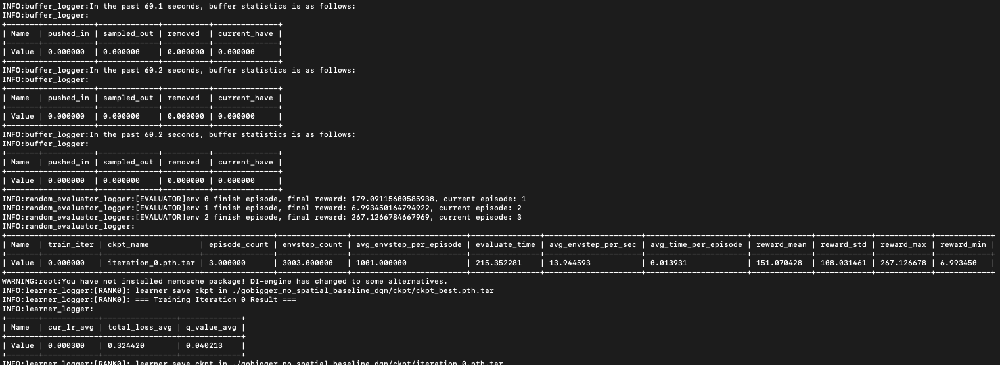
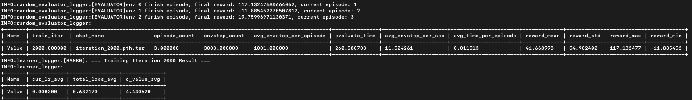

# 如何训练强化学习的baseline

[en](https://github.com/opendilab/GoBigger-Challenge-2021/blob/main/di_baseline/README.md) / [中文](https://github.com/opendilab/GoBigger-Challenge-2021/blob/main/di_baseline/README_zh.md)

## 一、介绍baseline 

算法基线的目的是验证强化学习算法在问题环境下的初始效果，以及对各个环节的信息做一个简单的梳理和分析。当参赛者快速上手游戏之后，可以逐渐增加环境、算法和算力的复杂度，来设计一个性能最强的agent。

Go-Bigger环境的强化学习算法baseline，主要分为三部分：
- 环境瘦身：将原始游戏环境简化成适用于强化学习的标准环境格式
- 基础算法选择：根据环境的基本信息选择合理的基础RL算法
- 定制训练流程：根据环境的特殊特征定制训练流程

## 二、环境瘦身

### 1. 如何设计观察空间

Go-Bigger以人类的视角是这样的：

<div align=center></div>

而翻译成游戏引擎中的结构化信息是这样的：

<div align=center></div>

这些理解起来很简单的数据表示对于计算机和神经网络是非常不友好的，因此我们需要对这些信息做一定的加工，并根据强化学习的特性，设置成标准的强化学习环境观察空间。

1. 特征工程：
    - 原始的游戏数据需要表达游戏内容，所以它们的数值范围波动比较大（比如从几十到几万的球体大小），直接将这样的信息输入给神经网络会造成一些训练的不稳定，所以需要根据信息的具体特征进行一定的处理（比如归一化，离散化，取对数坐标等等）。
    - 像类别信息这样的特征，不能直接用原始的数值作为输入，因为数字只是编号并不代表任何的大小信息，常见的做法是将这样的信息进行独热编码，映射到一个两两之间距离相等的表示空间。
    - 对于坐标这样的信息，使用绝对坐标会带来一些映射关系的不一致问题，相对坐标通常是更好的解决方式。
2. 从RGB图像到特征图像层
    - 直接将原始的RGB 2D图像信息输入神经网络，虽然理论上也可以学习到不错的结果，但是往往需要更多的数据，更长的训练时间，以及更复杂的训练技巧。一个很简明但是有效的方式是进行“升维”，将耦合在一起的图像信息离解成多个分离的特征图像层，换句话说就是增加2D图像的通道，每一个通道拥有相对独立的语义，比如某个通道负责建模荆棘，那么它就只包含荆棘相关的信息，如果对应空间位置上有荆棘就为1否则就为0。最终根据游戏内容定义出具体的特征图像层，并区分各个玩家的局部视野，拼接起来构成总体的特征图像层。下图就是一个玩家视野中食物的特征图像层：
  
<div align=center></div>

3. 可变维度
    - 最后也是最折磨的地方，Go-Bigger环境中其实存在很多可变维度的地方，例如单位（单位指食物，荆棘，孢子，分身球的集合）的个数一直会发生变化，比如吃掉食物，分裂新的分身球等等，为了简便，我们在baseline环境中强行截断单位数量，多于200的单位信息直接丢弃，少于200的情况则用等长的零向量补齐；而随着玩家大小的变化，其看到的2D视野范围也是不断变化的（最初是300x300），所以2D特征图像层的宽高是会随着游戏进程不断变化的，同样我们也做了处理，将所有的2D图像在环境中缩放为统一的固定尺寸，用暴力统一的方式来规避可变维度问题。

4. One-Hot编码

    - One-Hot编码是分类变量作为二进制向量的表示。这首先要求将分类值映射到整数值。然后，每个整数值被表示为二进制向量，除了整数的索引之外，它都是零值，它被标记为1。可以查看[代码具体实现路径](https://github.com/opendilab/GoBigger-Challenge-2021/blob/main/di_baseline/my_submission/envs/gobigger_env.py#L15)
    
    ``` python
        def one_hot_np(value: int, num_cls: int):
            ret = np.zeros(num_cls)
            ret[value] = 1
            return ret
    ```
5. 相对坐标实现
   
    - 使用相对位置可以避免位置数值过大或者过小带来的训练不稳定性。[代码具体实现路径](https://github.com/opendilab/GoBigger-Challenge-2021/blob/main/di_baseline/my_submission/envs/gobigger_env.py#L139-L142)
    ``` python

        left_top_x,right_bottom_x = ori_left_top_x/self._map_width,ori_right_bottom_x/self._map_width
        left_top_y,right_bottom_y = ori_left_top_y/self._map_height,ori_right_bottom_y/self._map_height

        position = [
            (position[0] - ori_left_top_x) / (ori_right_bottom_x - ori_left_top_x),
            (position[1] - ori_right_bottom_y) / (ori_left_top_y - ori_right_bottom_y)
            ]
    ```    
   
6. Tips
    - 暴力截断单位数量会存在什么问题？如果允许单位可变，会对代码实现和模型训练带来什么挑战?
    - 部分特征图像层存在过于稀疏的问题，那么除了卷积神经网络，有其他的建模方式吗?
    - 只用单帧数据作为观察会有什么问题吗？如果考虑观察空间的序列关系，该如何实现?

### 2. 如何设计动作空间

Go-Bigger对于人类来说操作起来十分简单，上下左右QWE（不对没有R），但这些基本的按键组合起来便可以诞生出许多有趣的操作，比如十面埋伏（分裂成多个小球包围对手），大快朵颐（快速按指定方向分裂大量吞噬食物）等等。

但游戏引擎中实际的动作空间是这样的（动作类型 + 动作参数）：

<div align=center></div>

1. 游戏引擎的这种形式在强化学习中被称作混合动作空间，也有一些相应的算法来处理这个问题，但是不要忘了baseline的核心——一切从简，在这里我们使用比较简单粗暴的离散化，将连续的动作参数（x，y坐标）离散化为上下左右四个方向，然后对于动作类型和动作参数的组合，也简单使用二者的笛卡尔积来表示，这样最终将环境定义为一个16维的离散动作空间。至于某些动作没有相应的参数这个问题，游戏引擎内部已经实现了相应的处理模块，所以我们也不用担心。
2. Tips
    - 如果使用混合动作空间，环境该如何实现?
    - 混合动作空间下，连续动作参数的范围是否要进行归一化，如果是，应该怎么实现?
    - 目前的游戏引擎是同步执行，即所有玩家都是在同一帧执行动作，但如果是异步的，动作空间又会发生什么变化?

### 3. 如何设计奖励函数

1. 奖励函数定义了强化学习优化的目标方向，而Go-Bigger顾名思义，就是比谁的队伍（比谁的队伍总体积/总体量/总重量更大）更大的对抗游戏，因此奖励函数的定义也非常简单，就是相邻两帧整个队伍的大小之差。
2. 注意这里并不是具体的每个玩家，而是多个玩家构成的一个队伍的大小收益。对于整场比赛(对应RL中episode的概念),我们使用每一步奖励的累加和作为最终的评价值，最大的队伍即为赢得了本局比赛。
3. 另外，在训练时，为了使奖励的尺度波动不要太大，我们简单地通过缩放和截断等手段将奖励值限制在[-1, 1]范围内。
4. Tips
    - 除了暴力硬编码截断，还有什么方式来处理奖励函数呢?

## 三、基础算法选择
在完成RL环境的魔改之后，我们观察一下这个环境的基本信息：
  - 多模态观察空间：图像信息 + 单位属性信息 + 全局信息
  - 离散动作空间：16维离散动作
  - 奖励函数：稠密的奖励函数，且取值已经处理到[-1, 1]
  - 终止状态：并没有真正意义上的终止状态，只是限制比赛的最大时间

对于这样的环境，很自然地就想到可以用最经典的DQN算法 + 多模态编码器神经网络来实现。对于各种模态的观察信息，使用数据对应的经典神经网络架构即可：
  - 例如图像信息选择一个带降采样的卷积神经网络将2D图像编码为特征向量
  - 而单位属性信息，我们需要建模各个单位之间的联系，每个单位是一个向量表示，那就可以复用Transformer中的编码器结构，并将编码器的输出在单位维度进行平均，获得最终的单位特征向量
  - 而全局信息，就是一个非常常见的长向量，使用由全连接层构成的多层感知机即可。
  - 各部分编码完成之后，将三部分的特征拼接在一起构成这个时间步的观察特征向量，就可以复用最经典的Dueling DQN结构，以特征向量为输入，输出这一步选择16个动作的Q值，并使用N-step TD损失函数完成相应训练的优化，完整的神经网络结构如下图所示。

    <div align=center></div>
    
当然，一些必备的DQN组件，比如经验回放队列（replay buffer），为了抑制Q值过估计的Double DQN模块，为了平衡探索和利用所用的eps-greedy，都需要添加在算法相应的阶段中。

## 定制训练流程

DQN通常只用来解决单智能体的问题，而Go-Bigger一个队伍中存在多个玩家，一局比赛又是多个队伍大混战，因此就涉及到了多智能体之间合作和对抗的问题，而这个问题在多智能体强化学习领域又可以展开诸多的研究方向，但这里我们依旧简化设计，使用Independent Q-Learning + Self-Play的方式来实现训练流程。


1. 如何处理一个队伍多个智能体
对于一个队伍中的多个智能体，团队的最终目标是让整个队伍（总体积/总体量/总重量）的大小最大，我们在baseline中使用IQL算法来实现，即每一个玩家对应一个DQN策略，而每个策略都使用全局的奖励函数来指导优化，并且所有玩家的DQN策略共享一套神经网络参数。按照这样的逻辑，可以高度并行化地实现整个优化过程。

2. Tips：
    - 如果要建模多个智能体之间的合作收益，可以有哪些做法
    - 如果每个玩家使用一个自己独有的策略，该如何分享他们学习到的知识

3. 如何处理多个队伍的博弈
对于实际一局比赛中存在多个智能体的情况，我们使用最朴素的自我对战（Self-Play）方式来参与比赛（最简单最省算力的方式），如果训练时比赛需要三个队伍，则我们会将上文中的算法模型复制三份，作为三个队伍所使用的策略来进行对战，他们所产生的三部分数据都会加入经验回放队列中参与训练。而评测时，我们会将随机机器人和基于规则的机器人作为比赛的对手，测试验证目前智能体的性能。

4. Tips：
    - 使用更高级的Self-Play算法，比如保存智能体的中间历史版本，或使用PFSP算法
    - 构建一个League Training流程，不同队伍使用不同的策略，不断进化博弈
    - 设计一些基于规则的辅助机器人参与到训练中，帮助智能体发现弱点，学习到新技能。其可以作为预训练的标签，也可以是构造蒸馏训练方法的老师，同时还可以作为League Training中的对手。


## 四、开始训练

我们已经准备好了一份baseline,其采用IDQN+Self-Play模式，在观察空间对单位信息采用强制截断策略，在动作空间采用16维的离散空间。我们的baseline基于开源强化学习平台DI-engine。那我们快速开始吧！

1. 实验配置
   本次实验所需配置为单机单卡实验，内存大小建议为32G，可根据buffer大小自行估算。

2. 安装必要的环境库
```
git clone https://github.com/opendilab/DI-engine
cd YOUR_PATH/DI-engine/
pip install -e . --user
```

3. 开始训练baseline
```
git clone https://github.com/opendilab/GoBigger-Challenge-2021/
cd YOUR_PATH/GoBigger-Challenge-2021/di_baseline/my_submission/entry/
python gobigger_selfplay_baseline_main.py
```

4. 训练阶段
   训练中会输出buffer信息，刚开始buffer并未采集到数据，显示为0是正常状态。每次训练开始在train_iter=0时会进行评估，评估的目的是记录最初随机初始化的性能。训练开始会打印神经网络结构信息，然后输出log信息，log信息示例如下，
   <div align=center></div>
 
   训练中会显示每次push到buffer中的数据，buffer的大小在[config文件中](https://github.com/opendilab/GoBigger-Challenge-2021/blob/main/di_baseline/my_submission/config/gobigger_no_spatial_config.py#L46)可以进行设置。下图为训练log信息，其中包括奖励reward信息、学习率、损失值以及Q值。
      <div align=center></div>

5. 训练结果
   
   训练的log信息会自动保存在以config的exp_name参数命名的文件夹下，可使用tensorboard查看训练信息以及实时训练情况。


